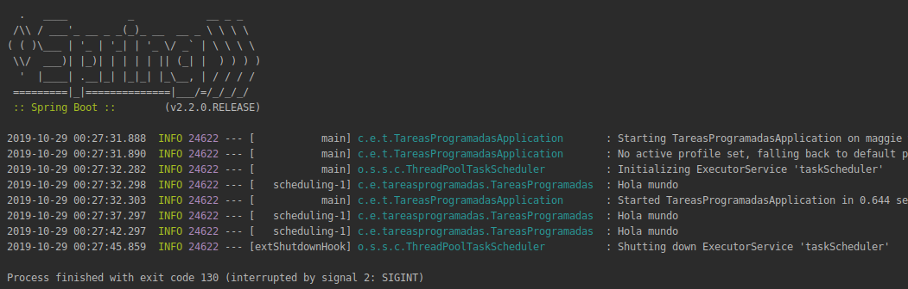

## Tareas programadas con Spring

### OBJETIVO

Hacer que tareas se ejecuten cada cierto tiempo usando Spring.

#### REQUISITOS

Tener instalado y configurado IntelliJ Idea y crear un proyecto con Spring Initializr usando `gradle`. De ahora en adelante usaremos gradle como manejador de dependencias.

#### DESARROLLO

Una vez creado un proyecto con Spring Initializr vamos a empezar a explorar las facilidades que nos ofrece Spring y Spring Boot para desarrollar aplicaciones de backend. Empezaremos con algo sencillo: hacer que Spring ejecute una tarea cada cierto tiempo.


Empecemos creando una nueva clase en `src/main/java/com.example.tareasprogramadas` llamada **TareasProgramadas** con el siguiente código:

```java
import lombok.extern.slf4j.Slf4j;
import org.springframework.scheduling.annotation.Scheduled;
import org.springframework.stereotype.Component;

@Component
@Slf4j
public class TareasProgramadas {

    @Scheduled(fixedRate = 5000)
    public void saludar() {
        log.info("Hola mundo");
    }
}
```

Por ultimo agregaremos una notación a nuestra aplicación para activar la planificación de tareas. [TareasProgramadasApplicacion.java](tareas-programadas/src/main/java/com/example/tareasprogramadas/TareasProgramadasApplication.java)



