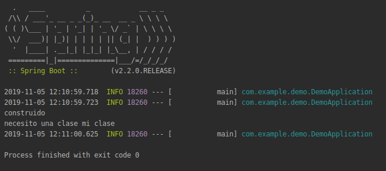

## Inyección de dependencias

### OBJETIVO

Entender la inyección de dependencias a traves de un ejemplo.

#### REQUISITOS

Un proyecto básico de spring boot como los que se hicieron en sesiones pasadas.

#### DESARROLLO

Con este ejemplo vamos a hacer uso de la inyección de dependencias y del contenedor de spring.

Empezamos por definir una interface **MiInterface**

```java
public interface MiInterface {
    String miMetodo();
}
```
y haciendo una implementación de esta interface **MiClase**

```java
import lombok.extern.slf4j.Slf4j;

import javax.annotation.PostConstruct;

@Slf4j
public class MiClase implements MiInterface {
    @Override
    public String miMetodo() {
        return "mi clase";
    }

    // este metodo se ejecuta cuando se termina de construir una instancia
    @PostConstruct
    public void mensaje() {
        log.info("construido");
    }
}
```
así como una factory **MiFactory** para esta clase, el uso de factories en java es muy común y son clases que sirven para construir instancias de otra clase, en este caso de clase `MiClase`.

```java
public class MiFactory {
    public MiClase getClase() {
        return new MiClase();
    }
}
```

Con esto podemos decirle a nuestra aplicación que registre un `Bean` del tipo `MiInterface` y cada vez que necesitemos una clase de tipo `MiInterface` podemos usar Spring para que nos provea de una instancia de este tipo como podemos ver en **NecesitoUnaClase**

```java
import lombok.extern.slf4j.Slf4j;
import org.springframework.beans.factory.annotation.Autowired;
import org.springframework.stereotype.Component;

import javax.annotation.PostConstruct;

@Component
@Slf4j
public class NecesitoUnaClase {

    // esta anotacion va a obtener un bean del tipo MiInterface del contenedor de spring
    @Autowired
    private MiInterface miInterface;

    // este metodo se ejecuta cuando se termina de construir una instancia
    @PostConstruct
    public void mensaje() {
       log.info("necesito una clase " +miInterface.miMetodo());
    }
}
```

Modificamos la clase principal para construir el Bean. 

```java
@SpringBootApplication
public class Sesion3TestApplication {

	@Bean
	public MiInterface mibean() {
		// usamos una factory para obtener una instancia del tipo
		// MiClase que implementa la interfaz MiInterfaz
		return new MiFactory().getClase();
	}

	public static void main(String[] args) {
		SpringApplication.run(Sesion3TestApplication.class, args);
	}

}
```


