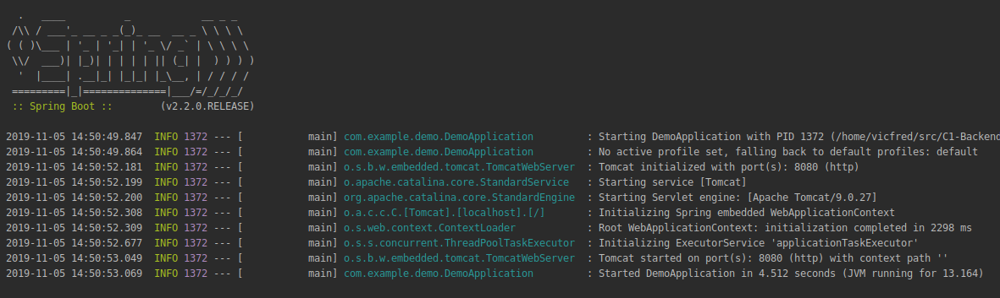

## Sirviendo aplicaciones

### OBJETIVO

Levantar un servidor tomcat y responder peticiones.

#### REQUISITOS

Un proyecto de spring boot con la dependencia Spring Web.

#### DESARROLLO

Una vez que descarguemos el proyecto de spring boot configurado con initializr con la dependencia Spring Web lo abrimos en IntelliJ IDEA y corremos la aplicación.



Como vemos spring boot automaticamente inicia un servidor Tomcat el cual podemos usar para servir peticiones HTTP.

Ahora creamos un controlador para servir peticiones `GET` a la ruta `/` y registramos la clase por medio de una anotación de spring `@RestController` y le asignamos la ruta `/` por medio de `@RequestMapping` como podemos ver en **Controlador** Ahora podemos hacer metodos que respondan a las rutas `/` y `/saluda/nombre` con metodos `GET`


```java
import org.springframework.web.bind.annotation.GetMapping;
import org.springframework.web.bind.annotation.PathVariable;
import org.springframework.web.bind.annotation.RequestMapping;
import org.springframework.web.bind.annotation.RestController;

@RestController
@RequestMapping("/")
public class Controlador {
    @GetMapping("/")
    public String hola() {
        return "Hola";
    }

    @GetMapping("/saluda/{nombre}")
    public String saludar(@PathVariable(value = "nombre") String nombre) {
        return "Hola " + nombre;
    }
}
```

Volvemos a correr la aplicación y ahora podemos hacer peticiones `GET` usando nuestro navegador. En el navegador visitamos `http://localhost:8080/` y luego visitamos `http://localhost:8080/saluda/juan` y `http://localhost:8080/saluda/pedro`.

